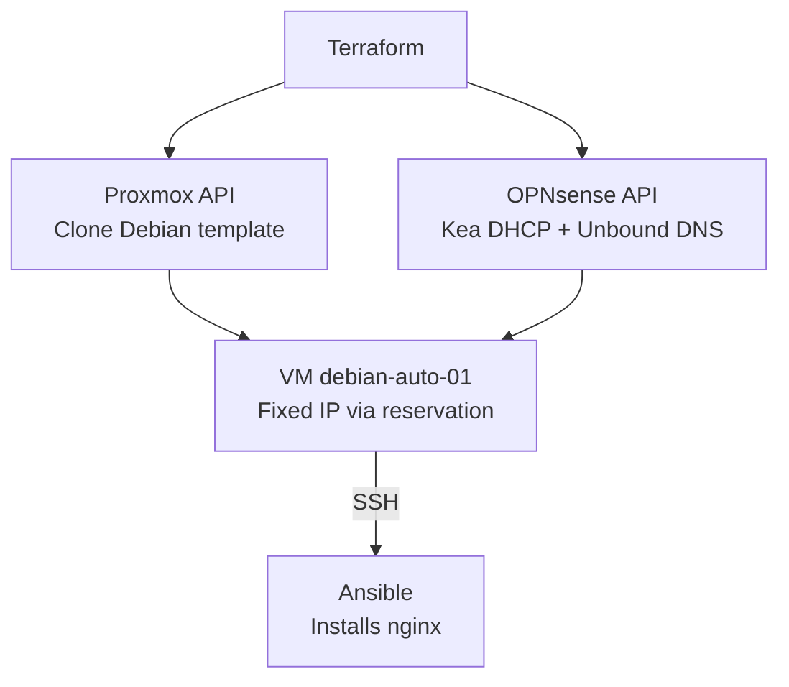

# Proxmox Terraform Ansible VM

Automated provisioning of a Debian VM on Proxmox with a stable MAC address, DHCP reservation and DNS entry on OPNsense, then configured with Ansible — zero manual steps.

## Architecture



## Stack

Terraform (`Telmate/proxmox`, `ivoronin/macaddress`, `browningluke/opnsense`) · Ansible · Proxmox VE · OPNsense (Kea, Unbound)

## Structure
terraform/ # VM, MAC, DHCP reservation
ansible/ # nginx install + config

## Usage

```bash
cd terraform
cp terraform.tfvars.example terraform.tfvars   # fill in your API credentials
terraform init
terraform plan
terraform apply

cd ../ansible
ansible-playbook -i inventory playbook.yml
```

## Why it's interesting

The same MAC address ties the Proxmox NIC to the OPNsense DHCP reservation, so the VM keeps its IP across recreations — which is what makes the Ansible inventory reliable without manual updates.

## Security

`terraform.tfstate` and `*.tfvars` are gitignored. Use `terraform.tfvars.example` as a template — never commit real credentials.